# unity-graphics-earth-core

A particle system simulates and renders many small images or Meshes, called particles, to produce a visual effect. Each particle in a system represents an individual graphical element in the effect. The system simulates every particle collectively to create the impression of the complete effect.

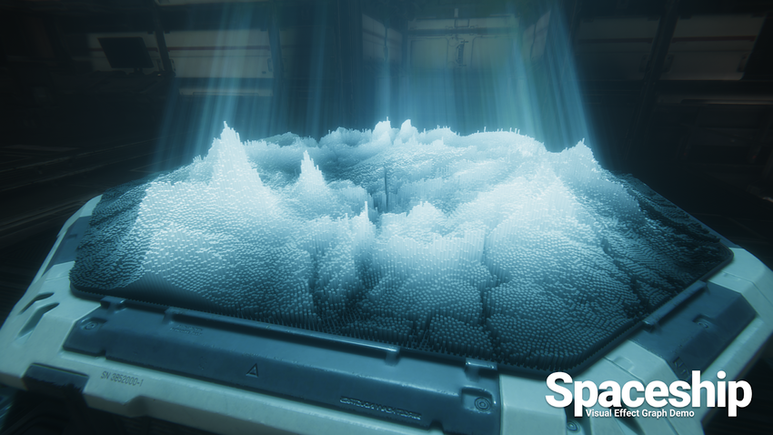

Particle systems are useful when you want to create dynamic objects like fire, smoke, or liquids because it is difficult to depict this kind of object with a Mesh (3D) or Sprite (2D). Meshes and Sprites are better at depicting solid objects such as a house or a car.

To provide flexibility when you author a particle system, Unity offers two solutions to choose from.The two particle system solutions are:

- The Built-in Particle System: A solution that gives you full read/write access to the system, and the particles it contains, from C# scripts. You can use the Particle System API to create custom behaviors for your particle system.
- The Visual Effect Graph: A solution that can run on the GPU to simulate millions of particles and create large-scale visual effects. The Visual Effect Graph also includes a visual graph editor to help you author highly customizable visual effects.

| Feature | Built-in Particle System | Visual Effect Graph |
| :--- | :--- | :--- |
| Render Pipeline Compatibility | Built-in Render Pipeline, Universal Render Pipeline, High Definition Render Pipeline | Universal Render Pipeline, High Definition Render Pipeline |
| Feasible number of particles  | Thousands | Millions |
| Particle system authoring | Simple modular authoring process that uses the Particle System component in the Inspector. Each module represents a predefined behavior for the particle. | Highly customizable authoring process that uses a graph view. |
| Physics | Particles can interact with Unity’s underlying physics system. | Particles can interact with specific elements that you define in the Visual Effect Graph. For example, particles can interact with the depth buffer |
| Script interaction | You can use C# scripts to fully customize the Particle System at runtime. You can read from and write to each particle in a system, and respond to collision events. The Particle System component also provides playback control API. This means that you can use scripts to play and pause the effect, and simulate the effect with custom step sizes. | You can expose graph properties and access them through C# scripts to customize instances of the effect. You can also use the Event Interface to send custom events with attached data that the graph can process. The Visual Effect component also provides playback control API. This means that you can use scripts to play and pause the effect, and simulate the effect with custom step sizes. |
| Frame buffers | No | In the High Definition Render Pipeline, provides access to the color and depth buffer. For example, you can sample the color buffer and use the result to set particle color, or you can use the depth buffer to simulate collisions. |

Unity’s Built-in Particle System allows you to create effects for every platform that Unity supports. The Built-in Particle System simulates particle behavior on the CPU which allows for the following main benefits:

- You can use C# scripts to interact with a system and the individual particles within it.
- Particle systems can use Unity’s underlying physics system and thus interact with Colliders in your Scene.

The Built-in Particle System uses a component, so placing a Particle System in a Scene is a matter of adding a pre-made GameObject (menu: **GameObject** > **Effects** > **Particle System**) or adding the component to an existing GameObject (menu: **Component > Effects > Particle System**). Because the component is quite complicated, the Inspector is divided into a number of collapsible sub-sections or **modules** that each contain a group of related properties.

When a GameObject with a Particle System is selected, the **Scene** view contains a small **Particle Effect** panel, with some simple controls that are useful for visualising changes you make to the system’s settings.

 

| Part of the panel | Function |
| :---------------- | :--- |
| Playback Speed | To speed up or slow down the particle simulation. |
| Playback Time |  Indicates the time elapsed since the system was started; this may be faster or slower than real time depending on the playback speed.|
| Particle (Count) | Indicates how many particles are currently in the system. |
| Speed Range | Indicate the start speed of the particle, applied in the startin direction. |
| Simulate layers | Automatically preview all looping Particle Systems on the chosen layers, in addition to selected Game Objects. |
| Resimulate | If enabled, the Particle Systems will show changes made to the system immediately (including changes made to the Particle System Transform). |
| Show Bounds | Show world space bounding boxes |
| Show Only Selected | If disabled, all unselected Particle Systems in the current effect will be hidden. | 

The Particle System component has many properties, and for convenience, the Inspector organises them into collapsible sections called “modules”.

The Particle System component has a powerful set of properties that are organized into modules for ease of use. This section of the manual covers each of the modules in detail. The list of modules is as follows:

List of Modules
- [Main Module](#main-module)
- [Emission Module](#emission-module)
- [Shape Module](#shape-module)
- [Velocity over Lifetime Module](#velocity-over-lifetime-module)
- [Noise Module](#noise-module)
- [Limit Velocity over Lifetime Module](#limit-velocity-over-lifetime-module)
- [Inherit Velocity Module](#inherit-velocity-module)
- [Lifetime by Emitter Speed Module](#lifetime-by-emitter-speed-module)
- [Force over Lifetime Module](#force-over-lifetime-module)
- [Color over Lifetime Module](#color-over-lifetime-module)
- [Color by Speed Module](#color-by-speed-module)
- [Size over Lifetime Module](#size-over-lifetime-module)
- [Size by Speed Module](#size-by-speed-module)
- [Rotation over Lifetime Module](#rotation-over-lifetime-module)
- [Rotation by Speed Module](#rotation-by-speed-module)
- [Triggers Module](#triggers-module)
- [Texture Sheet Animation Module](#texture-sheet-animation-module)
- [Lights Module](#lights-module)
- [Trails Module](#trails-module)
- [Custom Data Module](#custom-data-module)
- [Renderer Module](#renderer-module)
- [Collision Module](#collision-module)
- [Sub Emitters Module](#sub-emitters-module)
- [External Forces Module](#external-forces-module)

## Main Module
The Particle System module contains global properties that affect the whole system. Most of these properties control the initial state of newly created particles. To expand and collapse the main module, click the Particle System bar in the Inspector window.

| Property | Function |
| :--- | :--- |
| Duration | The length of time the system runs. |
| Looping | If enabled, the system starts again at the end of its duration time and continues to repeat the cycle. |
| Prewarm | If enabled, the system is initialized as though it had already completed a full cycle (only works if **Looping** is also enabled). |
| Start Delay | Delay in seconds before the system starts emitting once enabled. |
| Start Lifetime | The initial lifetime for particles. |
| Start Speed | The initial speed of each particle in the appropriate direction. |
| 3D Start Size	| Enable this if you want to control the size of each axis separately. |
| Start Size | The initial size of each particle. |
| 3D Start Rotation | Enable this if you want to control the rotation of each axis separately. |
| Start Rotation | The initial rotation angle of each particle. |
| Flip Rotation	| Causes some particles to spin in the opposite direction. |
| Start Color	| The initial color of each particle. |
| Gravity Modifier | Scales the gravity value set in the Physics window. A value of zero switches gravity off. |
| Simulation Space | Controls whether particles are animated in the parent object’s local space (therefore moving with the parent object), in the world space, or relative to a custom object (moving with a custom object of your choosing). |
| Simulation Speed | Adjust the speed at which the entire system updates. |
| Delta Time | Choose between **Scaled** and **Unscaled**, where **Scaled** uses the **Time Scale** value in the Time window, and **Unscaled** ignores it. This is useful for Particle Systems that appear on a Pause Menu, for example. |
| Scaling Mode | Choose how to use the scale from the transform. Set to **Hierarchy**, **Local** or **Shape**. Local applies only the Particle System transform scale, ignoring any parents. Shape mode applies the scale to the start positions of the particles, but does not affect their size. |
| Play on Awake | If enabled, the Particle System starts automatically when the object is created.
| Emitter Velocity | Choose how the Particle System calculates the velocity used by the Inherit Velocity and Emission modules. The system can calculate the velocity using a **Rigidbody** component, if one exists, or by tracking the movement of the **Transform** component. If no Rigidbody component exists, the system uses its Transform component by default.
| Max Particles | The maximum number of particles in the system at once. If the limit is reached, some particles are removed. |
| Auto Random Seed | If enabled, the Particle System looks different each time it is played. When set to false, the system is exactly the same every time it is played. |
| Random Seed | When disabling the automatic random seed, this value is used to create a unique repeatable effect. |
| Stop Action | When all the particles belonging to the system have finished, it is possible to make the system perform an action. A system is determined to have stopped when all its particles have died, and its age has exceeded its Duration. For looping systems, this only happens if the system is stopped via script. **Disable** means the GameObject is disabled, **Destroy** means the GameObject is destroyed, and **Callback** means the OnParticleSystemStopped callback is sent to any **scripts** attached to the GameObject. |
| Culling Mode | Choose whether to pause Particle System simulation when particles are offscreen. Culling when offscreen is most efficient, but you may want to continue simulation for off-one effects. **Automatic** means looping systems use **Pause**, and all other system use **Always Simulate.**, **Pause And Catch-up** means the system stops simulating while offscreen. When re-entering the view, the simulation performs a large step to reach the point where it would have been had it not paused. In complex systems, this option can cause performance spikes, **Pause** means the system stops simulating while offscreen, **Always Simulate** means The system processes its simulation on each frame, regardless of whether it is on screen or not. This can be useful for one-shot effects such as fireworks, where during the simulation would be obvious. |
| Ring Buffer Mode | Keeps particles alive until they reach the **Max Particles** count, at which point new particles recycle the oldest ones, instead of removing particles when their lifetimes elapse. **Disabled** means disabling the Ring Buffer Mode, so the system removes particles when their lifetime elapses, **Pause Until Replaced** means pauses old particles at the end of their lifetime until the **Max Particle** limit is reached, at which point the system recycles them, so they reappear as new particles, **Loop Until Replaced** means At the end of their lifetime, particles rewind back to the specified proportion of their lifetime until the **Max Particle** limit is reached, at which point the system recycles them, so they reappear as new particles. |

## Collision Module
Collision module allows your particles to collides with other game object in your scene.
This thing decides how particles bump into stuff in your scene. Pick Planes or World in the first menu to say if your collision rules are for flat surfaces or everything in the world.  
### Plane module properties
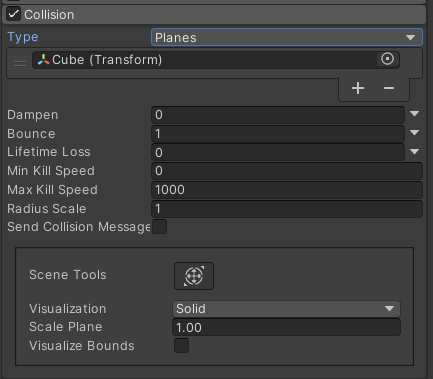
| Property | Function |
| -------- | -------- |
|Planes popup|Select Planes mode.|
|Planes|An expandable list of Transforms that define collision planes.|
|Visualization|Selects whether the collision plane Gizmos will be shown in the Scene view as wireframe grids or solid planes.|
|Scale Plane|Size of planes used for visualization.|
|Dampen|The fraction of a particle’s speed that it loses after a collision.|
|Bounce|The fraction of a particle’s speed that rebounds from a surface after a collision.|
|Lifetime Loss|The fraction of a particle’s total lifetime that it loses if it collides.|
|Min Kill Speed|Particles travelling below this speed after a collision will be removed from the system.|
|Max Kill Speed|Particles travelling above this speed after a collision will be removed from the system.|
|Radius Scale|Allows you to adjust the radius of the particle collision spheres so it more closely fits the visual edges of the particle graphic.|
|Send Collision Messages|If enabled, particle collisions can be detected from scripts by the OnParticleCollision function.|
|Visualize Bounds|Renders the collision bounds of each particle as a wireframe shape in the Scene view.|
### World module properties
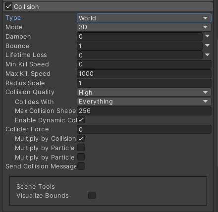
| Property | Function |
| -------- | -------- |
|World popup	|Select World mode.|
|Collision Mode	|3D or 2D.|
|Dampen|The fraction of a particle’s speed that it loses after a collision.|
|Bounce|The fraction of a particle’s speed that rebounds from a surface after a collision.|
|Lifetime Loss	|The fraction of a particle’s total lifetime that it loses if it collides.|
|Min Kill Speed	|Particles travelling below this speed after a collision will be removed from the system.|
|Max Kill Speed	|Particles travelling above this speed after a collision will be removed from the system.|
|Radius Scale	|Setting for 2D or 3D.|
|Collision Quality	|Use the drop-down to set the quality of particle collisions. This affects how many particles can pass through a collider. At lower quality levels, particles can sometimes pass through colliders, but are less resource-intensive to calculate.|
|Collides With	|Particles will only collide with objects on the selected layers.|
|Max Collision Shapes	|How many collision shapes can be considered for particle collisions. Excess shapes are ignored, and terrains take priority.|
|Enable Dynamic Colliders	|Dynamic colliders are any collider not configured as Kinematic|
|Voxel Size	|A voxel represents a value on a regular grid in three-dimensional space.|
|Collider Force	|Apply a force to Physics Colliders after a Particle collision. This is useful for pushing colliders with particles.|
|Multiply by Collision Angle	|When applying forces to Colliders, scale the strength of the force based on the collision angle between the particle and the collider. Grazing angles will generate less force than a head-on collision.|
|Multiply by Particle Speed	|When applying forces to Colliders, scale the strength of the force based on the speed of the particle. Fast-moving particles will generate more force than slower ones.|
|Multiply by Particle Size	|When applying forces to Colliders, scale the strength of the force based on the size of the particle. Larger particles will generate more force than smaller ones.|
|Send Collision Messages	|Check this to be able to detect particle collisions from scripts by the OnParticleCollision function.|
|Visualize Bounds	|Preview the collision spheres for each particle in the Scene view.|

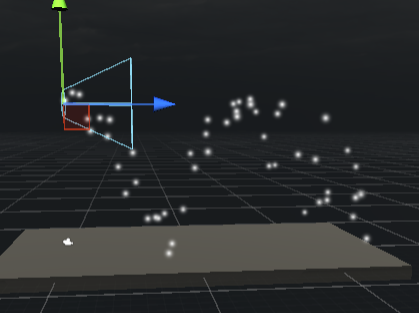

When using collisions, particle size can cause graphic clipping issues. The Radius Scale property helps by defining an approximate circular radius as a percentage of the actual size, preventing sinking effects.  

Dampen and Bounce properties are handy for solid objects—like gravel bouncing off surfaces, while snowball particles lose speed. Lifetime Loss and Min Kill Speed reduce residual particles after collisions, ideal for dissipating effects quickly, such as a fireball's particles after impact.

## Sub Emitters Module
Particle Systems allow for diverse effects at different lifetimes using sub-emitters. These are ordinary Particle System objects, creating nested effects.  
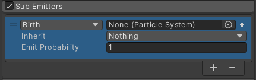
To trigger a sub-emitter, you can use these are the conditions:

- Birth: When the particles are created.  
- Collision: When the particles collide with an object.  
- Death: When the particles are destroyed.
- Trigger: When the particles interact with a Trigger collider.
- Manual: Only triggered when requested via script. See ParticleSystem TriggerSubEmitter.
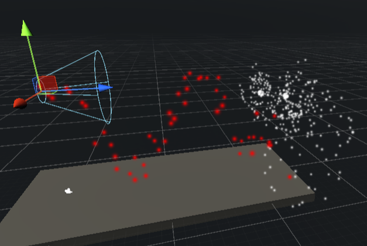

Burst emission is exclusive to Collision, Trigger, Death, and Manual events. Properties like size, rotation, color, and lifetime can be inherited from the parent particle to the sub-emitter.  

Velocity inheritance is controlled through the Inherit Velocity module.  

Emit Probability property adjusts the likelihood of sub-emitter events, with a value of 1 guaranteeing trigger and lower values reducing probability.  

## External Forces Module
External forces module make the particle affected by windzone in your scene
| Property | Function |
| -------- | -------- |
|Multiplier|Scale value applied to wind zone forces.|
|Influence Filter	|Choose whether to include Force Fields based on a Layer Mask, or via an explicit List.|
|List|Define an explicit list of Force Fields that can affect this Particle System. This appears when the Influence Filter is set to List.|
|Influence Mask	|Use a Layer Mask to determine which Force Fields affect this Particle System. This appears when the Influence Filter is set to Layer Mask.This is set to Everything by default, but you can enable or disable the following options individually: Nothing (automatically unticks all other options, turning them off); Everything (automatically ticks all other options, turning them on); Default; TransparentFX; Ignore Raycast; Water; UI; PostProcessing |

## Scripting Particle System
Script interface for the Built-in Particle System.  
[Scripting Documentation](https://docs.unity3d.com/ScriptReference/ParticleSystem.html)

## Creating Simple Rain
1. Create a Particle System rename it into rain and reset the transform, make the position y value to 15  
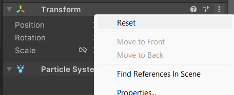
2. Set the shape in the shape module to box and set the scale x and z to 20 (you can make it bigger)  
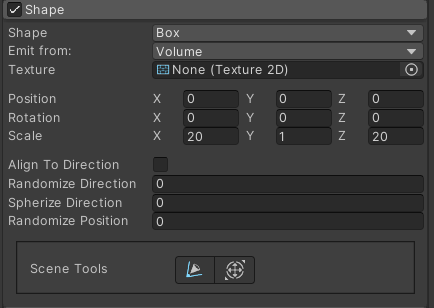  
3. Check the velocity over lifetime module and set the linear to random between two constants and set the y value to -25 and -35 (you can change the x value to add direction to the rain)  
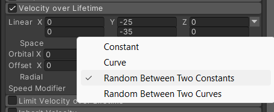  
4. In the renderer Module chang the render mode to streched billboard  
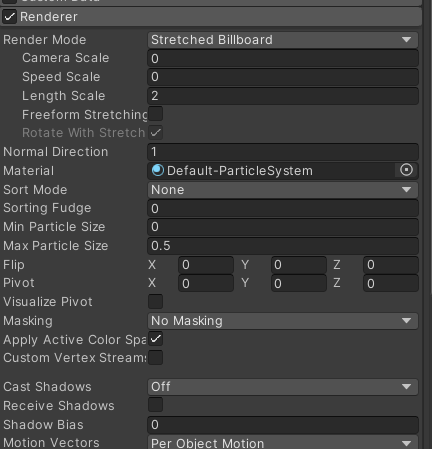  
5. In the main module check the 3d start size and set it to random between two constants and set the x value to 0.1 and 0.1, y value to 1 and 2, z value to 0.1 and 0.1, and set the start speed to 0, max particle to 10000  
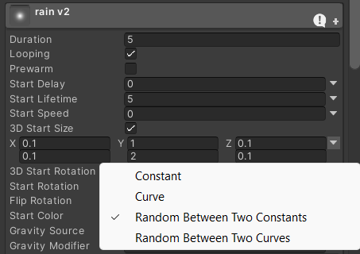  
6. In the same module set the start color transparency to around 70%  
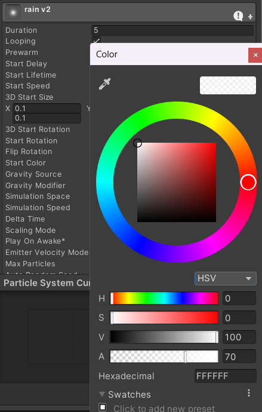    
7. In the Emmision module, change the rate over time to 500  
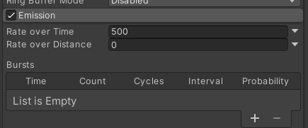  
8. Check the collision module and set  
type > world
Dampen > 1
Bounce > 0
lifetime loss > 0.4  
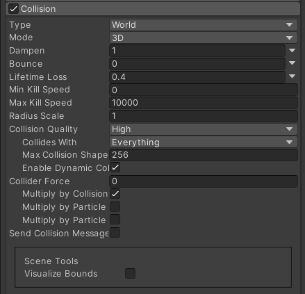  
Result:  
 
